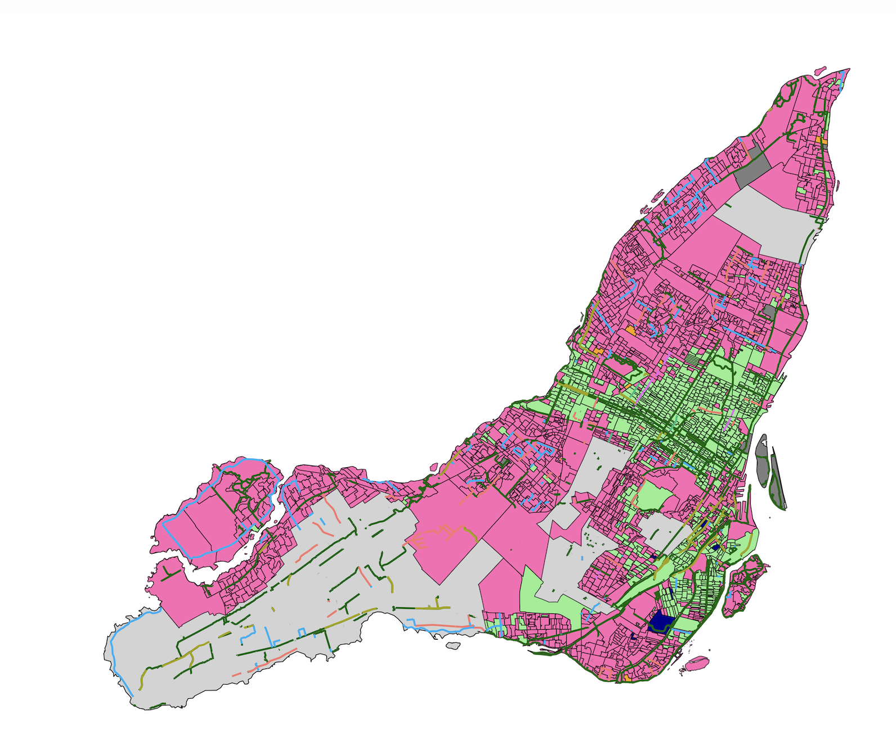

::: {.columns}
::: {.column width="60%"}
{fig-alt="Map showing the results of the 2026 Montreal election with bikelanes overlayed on the map"}
:::

::: {.column width="40%"}
This project maps the 2026 Montreal Election Results, and allows users to overlay neighborhood characteristics onto the results. Election results are mapped at the polling station level and coloured by the winner of that polling station. This project was created using **R** for data analysis (sf, dplyr) and **Leaflet** for visualization. 

*This is an early prototype*

[Availible Here](montreal_election.qmd){.btn .btn-outline-primary .btn role="button"}
:::
:::